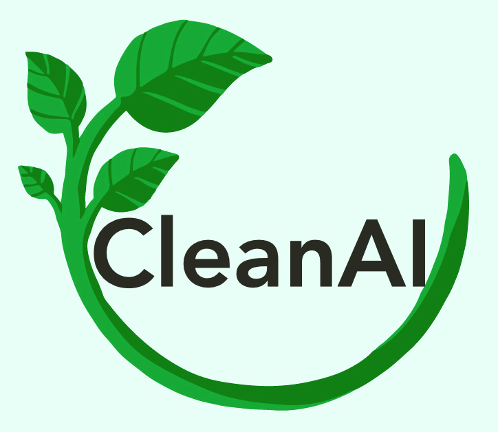

<div align="center">

</div>

<div align="center">
    <a href="logo" target="_blank">
        
    </a>
</div>

## Team Members - Group #2
- [Chelsea Zuvieta](https://www.github.com/czuv)
- [Juan Merlos Jr.](https://github.com/juambi01)
- [Nha Tran](https://github.com/nhatrangtrannt)

## Summary
The goal of our project was to create an API that provides the user with an easy-to-use and informative tool for waste classification. It leverages neural networks, utilizing TensorFlow and MobileNetV3Large as the base model, to classify different types of waste based on images uploaded by users. We also provide a tool for viewing drop-off locations for their waste within the NYC area. The user may also view attributes of their previously classified waste in the form of a table or chart. The API aims to streamline waste segregation processes, enabling waste management systems to effectively dispose of various types of garbage in an eco-friendly and efficient manner.

**Key Features**:
- User Authentication: The API supports user authentication, enabling users to create accounts, log in, and log out securely.
- Image-based Waste Classification (Classify Tab): The API allows users to upload waste images, which are then analyzed using neural networks to predict the waste type. It provides users with real-time classification results.
- Waste Type Information Retrieval (Classify Tab): Users can access information about specific waste types, such as categories and descriptions.
- Drop-off Locations Search: The API offers drop-off location search based on SiteType and Zipcode, helping users find convenient locations for specific types of waste disposal.
- Waste Classification Records (History Tab): The API provides a History tab, allowing users to search for their past waste classification records by providing a field name for filtering.
- Data Visualization (Portfolio Tab): The Portfolio tab presents data visualization in the form of interactive charts, including pie charts and stacked bar charts, enabling users to visualize their waste classification statistics and waste type distribution.

**Technologies and Tools used**:
  - TensorFlow and MobileNetV3Large: Neural networks used for waste classification based on images.
  - Flask: Python web framework for building the API.
  - Elasticsearch: Storage and retrieval of waste classification data and drop-off location data.
  - Pyrebase: Firebase integration for user authentication.
  - Chart.js: Library used for data visualization.
  - HTML, CSS, and JavaScript: Creating the structure and content of web pages.
  - Bootstrap: Make the user interface is responsive, mobile-friendly, and consistent across different devices and screen sizes

## Directories:
```tree
.
├── data              #CSV files (Drop-off location) and waste info
├── model            
│   ├── model.py         #Model loaded here 
│   ├── trained_pipeline-0.1.0.h5     #Trained model    
│   └── WasteClassification.ipynb     #Jupyter notebook for model
├── static               #Front-end materials 
├── templates            
│   ├── index.html       #Main Homepage
│   ├── login.html       #Login Page
│   ├── profile.html     #User Profile Page
│   └── register.html    #Register Page
├── .env-example            #Example of .env file should look like
├── firebase_key.json       #Put Firebase credentials here
├── ingest_csv_and_wasteinfo.py #Run this file to ingest data to Elastic
├── locationmapping.json        #Mapping for nyc-dropofflocations index
├── main.py               #Flask App with endpoints
├── README.md             #Project Documentattion
├── requirements.txt      #Requirements
└── wastemapping.json     #Mapping for wasteclassified index
```

## Installation

1. Clone the repository to your local machine
    ```shell
    git clone https://github.com/CEN5035-Summer-2023-Software-Eng/final-project-group_2.git
    ```
2. Installthe required dependencies
    ``` shell
    pip3 install -r requirements.txt
    ```
3. Set up the necessary environment variables by creating a `.env` file and a `firebase_key.json` file and obtaining your credentials from Elasticsearch and Firebase
- `.env`:
  ```env
  # Elastic Search Configuration
  cloud_id = YOUR_ELASTIC_CLOUDID
  elastic_username = YOUR_ELASTIC_USERNAME
  elastic_password = YOUR_ELASTIC_PASSWORD

  # Firebase Configuration
  apiKey = YOUR_API_KEY
  authDomain = YOUR_AUTH_DOMAIN
  databaseURL = YOUR_DATABASE_URL
  projectId = YOUR_PROJECT_ID
  storageBucket = YOUR_STORAGE_BUCKET
  messagingSenderId = YOUR_MESSAGING_SENDER_ID
  appId = YOUR_APP_ID
  measurementId = YOUR_MEASUREMENT_ID
  serviceAccount = YOUR_SERVICE_ACCOUNT_JSON
   ```

- `firebase_key.json`:
  ```json
  {
    "type": "service_account",
    "project_id": "PROJECT_ID",
    "private_key_id": "PRIVATE_KEY_ID",
    "private_key": "PRIVATE_KEY",
    "client_id": "CLIENT_ID",
    "auth_uri": "AUTH_URI",
    "token_uri": "TOKEN_URI",
    "auth_provider_x509_cert_url": "PROVIDE_CERT_URL",
    "client_x509_cert_url": "CLIENT_CERT_URL",
    "universe_domain": "UNIVERSE_DOMAIN"
  }
  ```

## Create mappings
If you already created one of the indexes below, please use `DELETE /index` to remove it from the database first and then run the CURL command below.

- Create mapping for `wasteclassified` index:
  ```shell
  curl -H "Content-Type: application/json" -u "elastic:password" -XPUT https://elastic-deployment.es.eastus2.azure.elastic-cloud.com/wasteclassified --data-binary @wastemapping.json 
  ```
- Create mapping for `nyc-dropofflocations` index:
  ```shell
  curl -H "Content-Type: application/json" -u "elastic:password" -XPUT https://elastic-deployment.es.eastus2.azure.elastic-cloud.com/nyc-dropofflocations --data-binary @locationmapping.json 
  ```

## Ingest data into Elasticsearch
Ingest CSV data for `nyc-dropofflocations` index and waste information for `waste-info` index
It should show you the total number of documents ingested into Elasticsearch after running it.
``` shell
python3 ingest_csv_and_wasteinfo.py
```

## Usage
```python
python3 main.py
```
Your web application will be available at `http://localhost:5678`

## API Endpoints 
See [Postman API Document](https://documenter.getpostman.com/view/27709590/2s946o5VJG#418e857a-74e1-4b5b-8299-cc7b088a1d89) for detailed information.

The following API endpoints are available:

- User Authentication Endpoints:
  - `POST /register`: Account registration
  - `POST /login`: User login
  - `POST /logout`: User logout
  - `GET /profile/<username>+<token>`: Direct to user's profile page

- Classify Tab - Waste Classification:
  - `POST /predict/image`: Predict waste type by uploading an image
  - `GET /display/<image_id>`: Display the image using the image ID
  - `GET /waste/<waste_type>`: Get waste type information by waste type

- Drop-off Locations Tab - Drop-off Locations Search:
  - `POST /searchByZipCodeSiteType`: Retrieve drop-off locations based on SiteType and Zipcode
  - `GET /findAllSiteTypes`: Retrieve all unique values for SiteType

- History Tab - Classified Waste Search by username:
  - `GET /findAllWasteFields/<index>`: Get all waste fields for dropdown
  - `POST /findInfoByUsernameAndField`: Retrieve waste info by username and field name

- Portfolio Tab - Get the number of Classified Waste by username:
  - `GET /findNumUniqueValuesWithinFieldByUsername`: Retrieve unique values from a field name based on username 
  - `GET /findClassifiedWasteByUsername`: Retrieve all classified waste by username 

## Contributing

Pull requests are welcome. For major changes, please open an issue first
to discuss what you would like to change.

## License
[MIT License](https://choosealicense.com/licenses/mit/)

## Acknowledgments
We would like to thank all the contributors and libraries that made this project possible. Your support is greatly appreciated!
- https://bootstrapmade.com/resi-free-bootstrap-html-template/
- https://bootstrapmade.com/nice-admin-bootstrap-admin-html-template/
- https://towardsdatascience.com/advanced-waste-classification-with-machine-learning-6445bff1304f
- https://github.com/AgaMiko/waste-datasets-review/tree/main
- https://github.com/nikhilvenkatkumsetty/TrashBox
- https://www.elastic.co/guide/en/elasticsearch/client/python-api/current/getting-started-python.html
